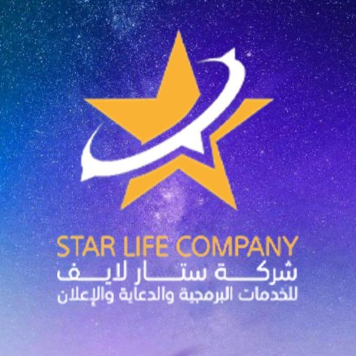

# ⭐ Star Life - Flutter App

<p align="center">
  
</p>

<p align="center">
  <strong>A professional Flutter application for Star Life Company</strong>
</p>

<p align="center">
  <a href="#features">Features</a> •
  <a href="#architecture">Architecture</a> •
  <a href="#screenshots">Screenshots</a> •
  <a href="#getting-started">Getting Started</a> •
  <a href="#tech-stack">Tech Stack</a>
</p>

---

## 📱 About

**Star Life Company** - شركة ستار لايف للخدمات البرمجية والدعاية والإعلان

A company specialized in software services and advertising 💻✨

We offer our exceptional services to individuals, businesses, and organizations 🌟🤝

This Flutter application is built as a technical assessment showcasing professional UI development, clean architecture patterns, state management with Cubit, and API integration.

## ✨ Features

### 🚀 Splash Screen
- Animated logo with pulsing glow effect
- Gradient text with Star Life branding
- Arabic and English company name
- Smooth fade transition to login

### 🔐 Authentication
- **Login Screen** with email and password
- Form validation:
  - Email format validation
  - Password minimum 6 characters
- API integration with [reqres.in](https://reqres.in) test API
- Loading states and error handling
- Success feedback with navigation
- Social login buttons (Google, Apple, Facebook)

### 🏠 Home Screen
- Welcome card with user status
- Quick action buttons
- Services list
- Custom bottom navigation
- Animated gradient background with stars effect

### 🎨 UI/UX
- Purple and gold color scheme extracted from Star Life branding
- Animated gradient backgrounds with twinkling stars
- Smooth transitions and micro-animations
- Custom buttons with press effects
- Glowing text fields on focus
- Responsive design

## 🏗️ Architecture

This project follows **Clean Architecture** principles with a **Feature-based** folder structure:

```
lib/
├── core/                          # Core functionality
│   ├── network/
│   │   └── api_client.dart        # Dio HTTP client
│   ├── theme/
│   │   ├── app_colors.dart        # Color palette
│   │   └── app_theme.dart         # ThemeData configuration
│   ├── utils/
│   │   └── validators.dart        # Form validators
│   └── widgets/
│       ├── custom_button.dart     # Animated button widget
│       ├── custom_text_field.dart # Styled text field
│       └── gradient_background.dart # Animated background
│
├── features/                      # Feature modules
│   ├── splash/
│   │   └── presentation/
│   │       └── pages/
│   │           └── splash_screen.dart
│   │
│   ├── auth/
│   │   ├── data/
│   │   │   ├── models/
│   │   │   │   └── user_model.dart
│   │   │   └── repositories/
│   │   │       └── auth_repository.dart
│   │   └── presentation/
│   │       ├── cubit/
│   │       │   ├── login_cubit.dart
│   │       │   └── login_state.dart
│   │       └── pages/
│   │           └── login_screen.dart
│   │
│   └── home/
│       └── presentation/
│           └── pages/
│               └── home_screen.dart
│
└── main.dart                      # App entry point
```

## 🛠️ Tech Stack

| Category | Technology |
|----------|------------|
| **Framework** | Flutter 3.x |
| **Language** | Dart 3.x |
| **State Management** | flutter_bloc (Cubit) |
| **Networking** | Dio |
| **Fonts** | Google Fonts (Poppins) |
| **Architecture** | Clean Architecture + Feature-based |

## 📦 Dependencies

```yaml
dependencies:
  flutter_bloc: ^9.0.0    # State management
  equatable: ^2.0.7       # Value equality
  dio: ^5.7.0             # HTTP client
  google_fonts: ^6.2.1    # Typography
```

## 🚀 Getting Started

### Prerequisites

- Flutter SDK 3.10.0 or higher
- Dart SDK 3.0.0 or higher

### Installation

1. **Clone the repository**
   ```bash
   git clone https://github.com/yourusername/task_starlife.git
   cd task_starlife
   ```

2. **Install dependencies**
   ```bash
   flutter pub get
   ```

3. **Run the app**
   ```bash
   flutter run
   ```

### Test Credentials

The app uses [reqres.in](https://reqres.in) as a mock API. Use these credentials to test:

| Email | Password |
|-------|----------|
| `eve.holt@reqres.in` | `cityslicka` |

## 🎨 Color Palette

The app uses a custom color scheme inspired by Star Life branding:

| Color | Hex | Usage |
|-------|-----|-------|
| 🟡 Primary Gold | `#E5A624` | Buttons, accents |
| 🟣 Deep Purple | `#1A0F30` | Background |
| 🟣 Gradient Start | `#2D1B4E` | Background gradient |
| 🟣 Gradient End | `#5B6B9A` | Background gradient |
| ⚪ White | `#FFFFFF` | Text, icons |

## 📋 Validation Rules

### Email
- Required field
- Must be valid email format (example@domain.com)

### Password
- Required field
- Minimum 6 characters

## 🔧 API Integration

The app integrates with **reqres.in** REST API:

```
Base URL: https://reqres.in/api
POST /login - User authentication
```

**Request:**
```json
{
  "email": "eve.holt@reqres.in",
  "password": "cityslicka"
}
```

**Response:**
```json
{
  "token": "QpwL5tke4Pnpja7X4"
}
```

## 📁 Project Structure Details

### Core Layer
- **Network**: API client configuration with Dio
- **Theme**: App-wide styling (colors, typography, component themes)
- **Utils**: Utility functions like validators
- **Widgets**: Reusable UI components

### Feature Layer
Each feature follows a consistent structure:
- **Data**: Models and repositories
- **Presentation**: UI (pages) and state management (cubit)

## ✅ Code Quality

- ✅ Clean Architecture principles
- ✅ Separation of concerns
- ✅ Reusable components
- ✅ Proper state management with Cubit
- ✅ Error handling
- ✅ Form validation
- ✅ No analysis issues (`flutter analyze` passes)

## 📄 License

This project is created as a technical assessment for Star Life Company.

---

<p align="center">
  Made with ❤️ using Flutter
</p>
